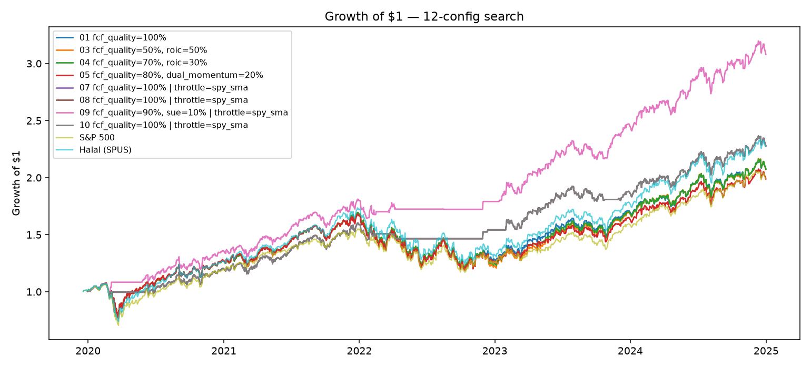
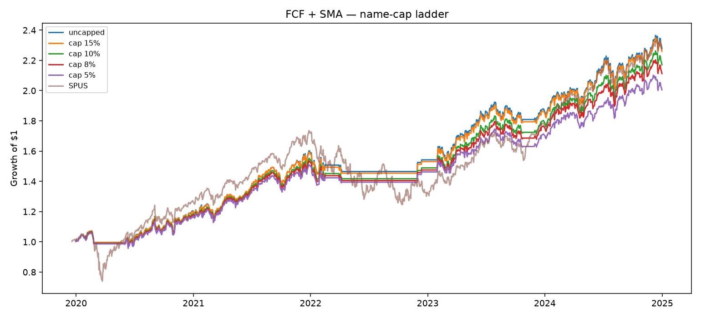
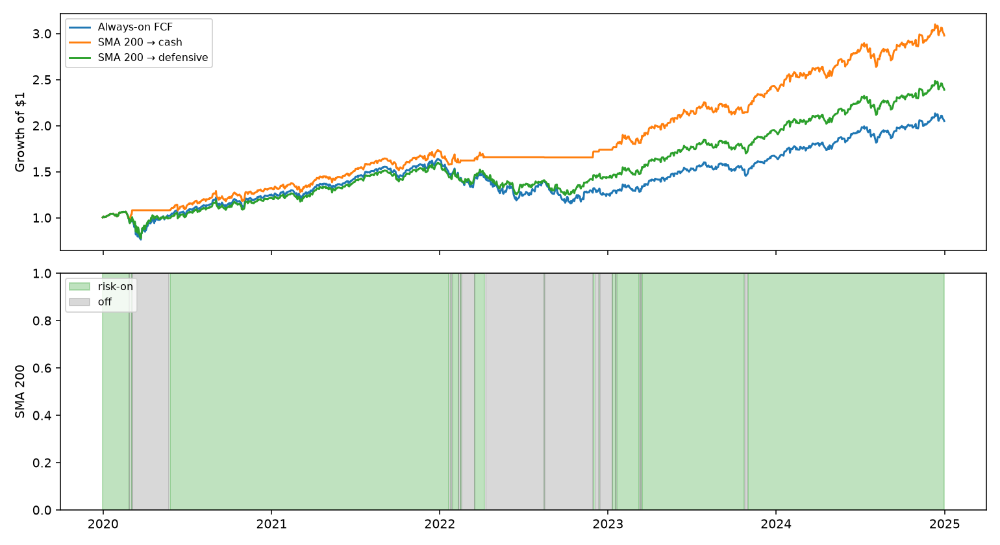

<div align="center">


# Halal Quant Research Lab

<p>
  
  
  
  
</p>

</div>

`Research/` is the **Phase 1 lab** for Monterey Finance. The product goal is simple: a **Halal equity book that grows steadily** — not the maximum possible return chase versus SPUS.

Work stays on historical market data. No live capital is deployed here.

---

## What we are optimizing for

| Priority | Meaning |
| --- | --- |
| **Steady growth** | Compound over time with drawdowns we can live with |
| **Halal first** | AAOIFI / activity screens are hard constraints |
| **Runnable rules** | Entry, exit, sizing, breach handling, purification — clear enough to operate |
| **Honest friction** | Turnover, costs, and purification drag are reported |

Beating SPUS is interesting. It is **not** the mandate.

---

## How a paper / study is done

1. Lock the universe (AAOIFI vs DJIM, sector screens, ratio limits).
2. Specify unambiguous entry, exit, sizing, and rebalance rules — no look-ahead.
3. Backtest vs a Halal benchmark (e.g. SPUS) and an all-stock benchmark (e.g. SPY).
4. Write up with the structure below (factor papers) or a shorter ops note (1B studies).
5. Decide: follow-up, revise, or kill.

Frozen live rules for papers **01, 02, 04, 05, 06** live in [`sleeves/`](sleeves/). New 1B notebooks should load that package instead of copying selector cells:

```python
import sys
from pathlib import Path
sys.path.insert(0, str(Path("../..").resolve()))  # Research/

from sleeves import FrozenRules, Lab

rules = FrozenRules().with_book(
    sleeve_weights={"fcf_quality": 1.0},
    name_cap=0.10,
    throttle="spy_sma",
)
lab = Lab.from_frames(metrics, prices, rules=rules)
returns, log = lab.book().run()
```

```text
Research/
├── README.md
├── sleeves/          # reusable live-rule loaders, thresholds, triggers
├── assets/
└── papers/
    ├── 01-fcf-ev/
    ├── 02-roic-engine/
    └── ...
```

---

## Standardized white paper structure

| Section | Target Content | Key Metrics |
| --- | --- | --- |
| **1. Hypothesis & Theory** | Logic and Sharia interaction | Factor, universe size, AAOIFI vs DJIM |
| **2. Strategy Rules** | Selection, sizing, risk | Entry/exit, rebalance, caps |
| **3. Empirical Performance** | Strategy vs Halal vs all-stock | CAGR, max DD, Sharpe, Sortino, Calmar |
| **4. Factor Attribution** | Stock pick vs sector tilt | Sector delta, α, β, tracking error |
| **5. Limitations & Friction** | Implementation reality | Turnover, slippage, purification drag |

Sharia compliance is a **hard constraint**. Screens are point-in-time. Failed names need an exit rule. Impure income is reported.

---

## Active backlog (Phase 1B)

Papers **07–09** built the working book: FCF quality engine, 10% name cap, whole-NAV trend throttle to cash. Do **10 → 12** next. **13–15** support the book once ops exist.

| # | Study | Status |
| --- | --- | --- |
| **07** | Multi-strategy sleeve blend | Done |
| **08** | Risk budget & concentration caps | Done |
| **09** | Book-level regime throttle | Done |
| **10** | Compliance breach exits | Next |
| **11** | Purification process design | Next |
| **12** | Turnover, costs & capacity | Next |
| **13–15** | Diversification audit, CVaR sizing, boundary monitoring | After 10–12 |

---

## Research backlog

Fifteen strategy concepts, grouped by the factor or structural mechanic they isolate inside a Halal-screened universe.

### Quality & Balance Sheet Dynamics

**1. Enterprise Value Cash Flow Yield (FCF/EV) ✅**

- **Mechanics:** Rank stocks by Free Cash Flow to Enterprise Value. Pair with AAOIFI debt-to-market cap limits (`< 30%`) to isolate capital-efficient firms.
- **White Paper Focus:** Measuring if leverage constraints naturally amplify the Quality Factor premium relative to the S&P 500.

<div>


**Cash Generation under AAOIFI Debt Limits:** *An Exploratory Backtest of Halal FCF Quality, 2023–2024*

This is an internal exploratory note, not a finished proof and not a live-return target. In the two calendar years 2023–2024, a cap-weighted basket of AAOIFI-screened S&P 500 names with free-cash-flow (FCF) margins in the top half of that month returned 42.4% compound annual growth, versus 25.9% for the S&P 500 (SPY) and 31.1% for a Halal large-cap ETF (SPUS). The live rule is cash generation, not cheapness: after banned businesses and the AAOIFI debt cap, we keep names that convert a large share of sales into free cash flow and own them in proportion to company size. The book is a Halal mega-cap quality/tech portfolio. Technology plus communication services averaged about 74% of weight. Much of the win is that tilt in a mega-cap boom, not a cycle-proof quality premium. A prior cheapness rule (FCF/enterprise value) was dropped after it missed Apple and Nvidia and lost to SPUS. That change used the same 2023–2024 window, so these results are partly in-sample.

[Read the white paper](papers/01-fcf-ev/Cash%20Generation%20under%20AAOIFI%20Debt%20Limits.pdf)
</div>
<br clear="all">


**2. Return on Invested Capital (ROIC) Reinvestment Engine ✅**

- **Mechanics:** Screen for high ROIC (`> 15%`) and high reinvestment rates among low-debt equities.
- **White Paper Focus:** Testing long-term compounding persistence in capital-light sectors like SaaS, Healthcare, and MedTech.

<div>


**High-ROIC Compounding under AAOIFI Debt Limits:** *An Exploratory Backtest of Halal ROIC Reinvestment, 2022–2024*

This is an internal exploratory note, not a finished proof and not a live-return target. From late 2022 through 2024, a cap-weighted basket of AAOIFI-screened S&P 500 names with ROIC above 15% and high reinvestment rates returned 39.6% compound annual growth, versus 22.9% for the S&P 500 (SPY) and 27.4% for a Halal large-cap ETF (SPUS). The live rule pairs a hard ROIC floor with the top half of that pool by reinvestment rate and owns names in proportion to company size. Inside the high-ROIC pool, high reinvestment beat low reinvestment (43.2% vs 28.7% CAGR), which supports the compounding hypothesis more than ROIC quintiles alone. The book is still a Halal mega-cap tech/platform portfolio: technology plus communication services averaged about 82% of weight. A robustness sleeve limited to SaaS, Healthcare, and MedTech returned 27.6% CAGR—roughly in line with SPUS, not a clear upgrade over the broad compounder book.

[Read the white paper](papers/02-roic-engine/High-ROIC%20Compounding%20under%20AAOIFI%20Debt%20Limits.pdf)
</div>
<br clear="all">


**3. Financial Distress & Distress-Risk Factor (SC_risk)**

- **Mechanics:** Sort stocks based on Altman Z-Score and Merton Distance-to-Default within Halal vs. non-Halal cohorts.
- **White Paper Focus:** Empirical proof of whether Sharia debt screens create an automatic systemic buffer against corporate bankruptcy during rate hikes.

### Momentum, Trend & Style Rotation

**4. Dual-Momentum Regime Switching ✅**

- **Mechanics:** Combine 12-1 month relative price strength with a 200-day Simple Moving Average (SMA) absolute trend rule for market entry/exit.
- **White Paper Focus:** Evaluating drawdown protection during market crashes when speculative, highly leveraged momentum turnarounds are pre-filtered out.

<div>


**Dual-Momentum Regime Switching under Halal Screens:** *An Exploratory Backtest of 12–1 Relative Strength and a 200-Day SMA Overlay, 2019–2024*

This is an internal exploratory note, not a finished proof and not a live-return target. From late 2019 through 2024, a cap-weighted basket of AAOIFI-screened S&P 500 names in the top quintile by 12–1 month relative strength versus SPY, held only when SPY was above its 200-day SMA, returned 18.8% compound annual growth, versus 14.8% for the S&P 500 (SPY) and 17.8% for a Halal large-cap ETF (SPUS). Maximum drawdown was −15.4%, roughly half the troughs of SPY (−33.7%) and SPUS (−30.8%). The SMA overlay is the main driver: the same momentum screen without the regime filter returned only 13.4% CAGR with a −30.2% drawdown. Dual momentum led in 2020 and limited 2022 losses to −5.5% while SPUS fell −22.8%; it lagged SPUS in the strong bull years 2021, 2023, and 2024. Relative-momentum quintiles inside the Halal pool are not monotonic—Q2 beat Q1—so the live edge looks more like regime timing than a clean relative-strength premium.

[Read the white paper](papers/04-dual-momentum-reg-switch/Dual-Momentum%20Regime%20Switching%20under%20Halal%20Screens.pdf)
</div>
<br clear="all">


**5. High-Beta Acceleration in Low-Debt Tech ✅**

- **Mechanics:** Target top-quintile Beta stocks specifically in technology and clean energy, rebalanced monthly.
- **White Paper Focus:** Measuring downside capture vs. upside participation when running high-beta growth strategies without leverage risk.

<div>


**High-Beta Acceleration in Low-Debt Tech:** *An Exploratory Backtest of Upside Participation versus Downside Capture under AAOIFI Screens, 2020–2025*

This is an internal exploratory note, not a finished proof and not a live-return target. From early 2020 through 2025, a cap-weighted basket of AAOIFI-screened technology and clean-energy names in the top quintile by trailing beta versus SPY returned 34.9% compound annual growth, versus 15.1% for the S&P 500 (SPY) and 17.7% for a Halal large-cap ETF (SPUS). An equal-weight Halal tech sleeve (no beta tilt) returned 20.3% CAGR, so the beta sort itself adds about 15 percentage points in this sample. The cost is risk: 43.4% volatility and a −48.8% maximum drawdown. Upside capture versus SPY is 1.90 and downside capture is 1.80—acceleration with only a mildly positive capture spread. Portfolio debt stays well under 5% while portfolio beta runs about 1.7–2.2. Beta quintiles are not monotonic (Q5 leads; Q3 beats Q1/Q2/Q4), and the book is mega-cap concentrated.

[Read the white paper](papers/05-high-beta/High-Beta%20Acceleration%20in%20Low-Debt%20Tech.pdf)
</div>
<br clear="all">


**6. Earnings Momentum & Earnings Surprise (SUE) ✅**

- **Mechanics:** Screen for Standardized Unanticipated Earnings (SUE) where actual EPS exceeds analyst consensus by `> 2σ`.
- **White Paper Focus:** Post-Earnings Announcement Drift (PEAD) efficacy in Halal equities vs. broad index constituents.

<div>


**Post-Earnings Announcement Drift under AAOIFI Screens:** *An Exploratory Backtest of Halal Earnings Surprise, 2020–2025*

This is an internal exploratory note, not a finished proof and not a live-return target. From early 2020 through 2025, an equal-weighted basket of AAOIFI-screened S&P 500 names with robust SUE above 2σ, entered the session after the print and held for 21 trading days, returned 27.7% compound annual growth, versus 15.1% for the S&P 500 (SPY) and 17.7% for a Halal large-cap ETF (SPUS). A broad-index twin with the same SUE rule and no AAOIFI overlay returned 28.6% CAGR, so Halal screens do not kill PEAD in this sample and do not add much extra return either. Mean CAR versus SPY after qualifying prints is +1.01% at 21 days in the Halal sleeve versus +1.44% in the full index. A first month-end, cap-weighted, 60-day book lagged both benchmarks (13.4% CAGR) because it owned stale mega-cap beats; event-time quintiles after that repair put Q5 at 28.2% CAGR and Q1 at −1.5%. Turnover is high, 2025 lagged SPUS, and about 16% of Yahoo prints still clear a nominal 2σ cutoff.

[Read the white paper](papers/06-earn-momentum-sue/Post-Earnings%20Announcement%20Drift%20under%20AAOIFI%20Screens.pdf)
</div>
<br clear="all">


### Fund Book Construction

**7. Multi-Strategy Sleeve Blend ✅**

- **Mechanics:** Combine kept sleeves (FCF quality, ROIC, dual-momentum regime, optional SUE satellite) into one Halal book with explicit sleeve weights and a shared monthly rebalance calendar.
- **White Paper Focus:** Whether a blended steady-growth book beats any single sleeve on drawdown-adjusted compounding after Halal screens.

<div>


**One Halal Book, Not Four Labels:** *An Exploratory Sleeve Mix, 2019–2024*

This is an internal exploratory note, not a finished proof and not a live-return target. Mixing FCF, ROIC, and dual momentum (40/40/20) did **not** make a steadier fund. The blend tracked FCF, lost about −27% in 2022 (worse than SPUS), and dual momentum as a 20% sleeve missed 2023. ROIC had almost no 2020–2022 history, so it could not be a second engine. Architecture takeaway: the stock list is **one quality funnel** (Halal screens, then FCF top half, cap-weighted). It is not a multi-strategy mix. SUE can add return in bull years; it is not the crash control.

[Open the study](papers/07-book-construction/blend-search.ipynb)
</div>
<br clear="all">


**8. Risk Budget & Concentration Caps ✅**

- **Mechanics:** Apply hard single-name and sector caps (and optional vol targeting) on the blended book; compare uncapped mega-cap concentration versus capped variants.
- **White Paper Focus:** How much steady-growth path improves when concentration risk is forced down without killing the Halal quality core.

<div>


**Name Caps on the FCF Book:** *An Exploratory Risk Budget, 2019–2024*

This is an internal exploratory note, not a finished proof and not a live-return target. After paper 07, the book under test was FCF quality with a whole-NAV SPY SMA. Uncapped, the five largest names still held about 48% of the invested book. A 10% single-name cap cut that to about 37% and cut CAGR only from 17.9% to 16.8%. Max drawdown stayed about −9.5% — the crash path is the SMA, not the cap. A 5% cap started to flatten the FCF engine. Architecture takeaway: size risk with a **10% name lid**. Do not expect a cap to replace the market switch or to fix the tech-heavy Halal mix.

[Open the study](papers/08-risk-budget/code.ipynb)
</div>
<br clear="all">


**9. Book-Level Regime Throttle ✅**

- **Mechanics:** Run the FCF book risk-on only when a market trend rule holds (e.g. SPY above its moving average); otherwise cut equity to cash or shift to a defensive Halal sleeve.
- **White Paper Focus:** Using dual-momentum-style regime logic as a whole-book drawdown brake, not as another stock-picking factor.

<div>


**Whole-NAV Trend Brake:** *An Exploratory Regime Throttle, 2019–2024*

This is an internal exploratory note, not a finished proof and not a live-return target. The on/off switch belongs on **100% of NAV**, not inside a 20% sleeve. Always-on FCF (with the 10% cap) still had about a −29% max drawdown. SMA-to-cash cut that to about −8% to −9%. A “defensive” Halal sleeve while the trend was off still fell about −26% to −27% — it was not a crash hedge. Faster rules (50-day SMA → cash) passed the frozen 2022/2023 checks with more flips; cash beat defensive in every case. Architecture takeaway: when the market trend is down, the fund holds **cash**, not a second stock list.

[Open the study](papers/09-regime-throttle/code.ipynb)
</div>
<br clear="all">


### Halal Operations & Friction

**10. Point-in-Time Compliance Breach Exits**

- **Mechanics:** Monitor AAOIFI debt / cash / receivables ratios between rebalances; define forced exit lags (same day, next open, month-end) when a held name fails.
- **White Paper Focus:** Operational exit rules for losing compliance — cost, tracking error, and what “steady” looks like under strict Sharia process.

**11. Purification Process Design**

- **Mechanics:** Estimate impure dividend income on holdings, schedule purification cash outflows, and measure net investor path versus gross backtest returns.
- **White Paper Focus:** Turning purification from a footnote into a runnable cash policy for a live Halal fund.

**12. Turnover, Costs & Capacity**

- **Mechanics:** Stress the blended book under trading-cost assumptions and AUM scales; find where liquidity and turnover break steady-growth economics.
- **White Paper Focus:** Practical capacity limits before Phase 2 capital raises.

### Portfolio Diagnostics (supporting)

**13. Sleeve Correlation & Diversification Audit**

- **Mechanics:** Measure pairwise correlations, overlapping holdings, and marginal risk contribution across quality, ROIC, momentum, and SUE sleeves.
- **White Paper Focus:** Whether the blend is real diversification or the same mega-cap tech book counted four ways.

**14. Tail-Risk Position Sizing (CVaR)**

- **Mechanics:** Size positions (or sleeve weights) using downside risk / CVaR instead of equal or cap weights inside the Halal universe.
- **White Paper Focus:** Left-tail control for a steady-growth mandate when conventional bonds and cash yield are limited.

**15. Compliance Boundary Monitoring**

- **Mechanics:** Track names near AAOIFI ratio boundaries (e.g. debt/market cap `28%–29%`) and model pre-emptive trims before forced index / screen exits.
- **White Paper Focus:** Early-warning compliance ops to reduce sudden turnover and gap risk in the live book.


---

## Phase 1A → 1B

### Phase 1A — Factor discovery (mostly done)

Test one idea at a time: hypothesis → point-in-time backtest → white paper → keep / revise / kill.

**What worked in-sample:** quality / cash generation, ROIC compounders, dual-momentum regime filter, selective earnings surprise (and high-beta tech as a high-risk sleeve).

**What failed:** deep value and high-dividend ranking (old value/dividend studies). In our window they underweight the Halal mega-cap growth core that dominates SPUS. That family is **not** in the active backlog.

### Phase 1B — Fund book design (07–09 done; 10–12 next)

Working architecture from 07–09: **FCF quality list + 10% name cap + whole-NAV trend throttle to cash**.

1. **Engine (07)** — one quality funnel, not a 40/40/20 mix. High-beta (05) stays out of the core.
2. **Size rule (08)** — 10% single-name cap.
3. **Market switch (09)** — SPY trend on/off on 100% of NAV; cash when off.
4. **Halal ops (10–11)** — mid-period AAOIFI breach exits; purification as a real process.
5. **Costs and capacity (12)** — turnover budget; at what size the book breaks.

A topic in 1B is complete when the folder has a reproducible notebook, figures, and a short write-up that answers: *would we run this?*

## What stays out of this folder

Live execution, brokerage integration, investor operations, and fund administration belong to **Phase 2**. This lab produces a reproducible universe, specified strategies, combined-book tests, and written findings — enough to decide whether further work is justified.
