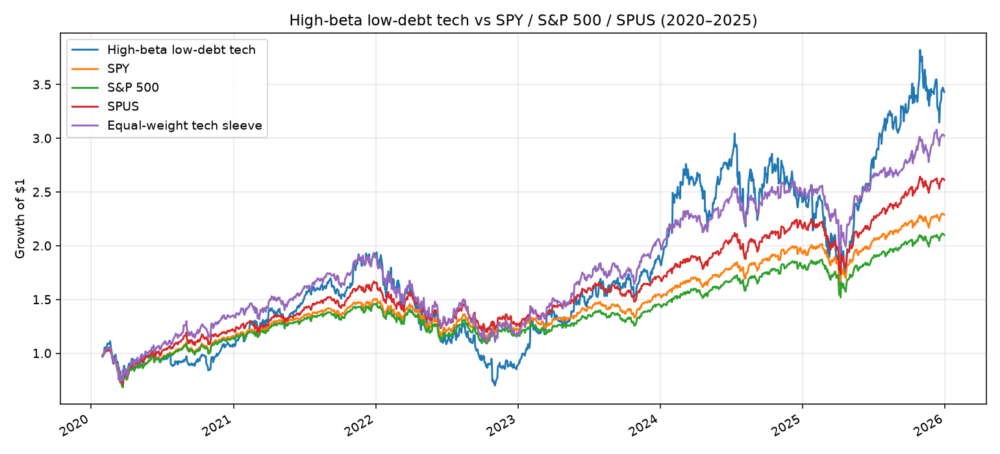

<div align="center">

# Halal Quant Research Lab

<p>
  
  
  
  
  
</p>

<!--
  Hero image placeholder.
  Add `assets/research-hero.png` and uncomment the tag below.
-->
<!--  -->

</div>

`Research/` is the **Phase 1 lab** for Monterey Finance: a backlog of **Halal quantitative strategies**, each taken from hypothesis through point-in-time backtest and into a published white paper. Work stays on historical market data. No live capital is deployed in this folder.

Every topic is researched against the **Halal-screened equity universe**, then written up in the same five-section report so weekly papers stay comparable: same metrics, same benchmarks, same friction accounting.

---

## How research is done here

Each of the **15 core strategy concepts** below follows the same loop:

1. **Pick a topic** from the backlog and lock the universe (AAOIFI vs. DJIM, sector screens, financial-ratio limits).
2. **Specify the strategy** with unambiguous entry, exit, sizing, and rebalancing rules — no look-ahead, point-in-time compliance only.
3. **Backtest** the strategy against a Halal index and an all-stock benchmark on real historical prices and fundamentals.
4. **Write the white paper** using the standardized structure below.
5. **Decide** whether the idea earns a follow-up, a revision, or a kill.

A topic is complete when its folder contains a finished white paper, the backtest artifacts needed to reproduce the tables, and an explicit note on purification drag, turnover, and stocks that enter or leave the universe.

Suggested layout as papers are opened:

```text
Research/
├── README.md
├── assets/                          
└── papers/
    ├── 01-fcf-ev/
    │   ├── whitepaper.md
    │   └── figures/
    ├── 02-roic-reinvestment/
    └── ...
```

---

## Standardized white paper structure

To deliver a clear report every week, every white paper uses this layout:

| Section | Target Content | Key Metrics to Include |
| --- | --- | --- |
| **1. Hypothesis & Theory** | Financial/economic logic behind the strategy and its interaction with Sharia constraints. | Target Factor, Universe Size, Screening Standard (AAOIFI vs. DJIM). |
| **2. Strategy Rules** | Unambiguous quantitative logic for selection, position sizing, and risk management. | Entry/Exit Rules, Rebalancing Frequency, Stop-Loss / Position Caps. |
| **3. Empirical Performance** | Backtest results comparing Strategy vs. Halal Index vs. All-Stock Benchmark. | CAGR, Max Drawdown, Sharpe Ratio, Sortino Ratio, Calmar Ratio. |
| **4. Factor Attribution** | Isolating whether outperformance stems from stock selection or structural sector bias. | Sector Exposure Delta, Alpha (α), Beta (β), Tracking Error. |
| **5. Limitations & Friction** | Realistic appraisal of implementation challenges. | Annualized Turnover, Slippage Estimate, Purification Drag. |

Sharia compliance is a **hard constraint**, not an optional overlay. Screens are applied at each point in time. If a held name fails during the sample, the paper must state the exit rule. Impure income that may require purification is reported, not ignored.

---

## Research backlog

Fifteen strategy concepts, grouped by the factor or structural mechanic they isolate inside a Halal-screened universe.

### Quality & Balance Sheet Dynamics

**1. Enterprise Value Cash Flow Yield (FCF/EV) ✅**

- **Mechanics:** Rank stocks by Free Cash Flow to Enterprise Value. Pair with AAOIFI debt-to-market cap limits (`< 30%`) to isolate capital-efficient firms.
- **White Paper Focus:** Measuring if leverage constraints naturally amplify the Quality Factor premium relative to the S&P 500.

<div>


**Cash Generation under AAOIFI Debt Limits:** *An Exploratory Backtest of Halal FCF Quality, 2023–2024*

This is an internal exploratory note, not a finished proof and not a live-return target. In the two calendar years 2023–2024, a cap-weighted basket of AAOIFI-screened S&P 500 names with free-cash-flow (FCF) margins in the top half of that month returned 42.4% compound annual growth, versus 25.9% for the S&P 500 (SPY) and 31.1% for a Halal large-cap ETF (SPUS). The live rule is cash generation, not cheapness: after banned businesses and the AAOIFI debt cap, we keep names that convert a large share of sales into free cash flow and own them in proportion to company size. The book is a Halal mega-cap quality/tech portfolio. Technology plus communication services averaged about 74% of weight. Much of the win is that tilt in a mega-cap boom, not a cycle-proof quality premium. A prior cheapness rule (FCF/enterprise value) was dropped after it missed Apple and Nvidia and lost to SPUS. That change used the same 2023–2024 window, so these results are partly in-sample.

[Read the white paper](papers/01-fcf-ev/Cash%20Generation%20under%20AAOIFI%20Debt%20Limits.pdf)
</div>
<br clear="all">


**2. Return on Invested Capital (ROIC) Reinvestment Engine ✅**

- **Mechanics:** Screen for high ROIC (`> 15%`) and high reinvestment rates among low-debt equities.
- **White Paper Focus:** Testing long-term compounding persistence in capital-light sectors like SaaS, Healthcare, and MedTech.

<div>


**High-ROIC Compounding under AAOIFI Debt Limits:** *An Exploratory Backtest of Halal ROIC Reinvestment, 2022–2024*

This is an internal exploratory note, not a finished proof and not a live-return target. From late 2022 through 2024, a cap-weighted basket of AAOIFI-screened S&P 500 names with ROIC above 15% and high reinvestment rates returned 39.6% compound annual growth, versus 22.9% for the S&P 500 (SPY) and 27.4% for a Halal large-cap ETF (SPUS). The live rule pairs a hard ROIC floor with the top half of that pool by reinvestment rate and owns names in proportion to company size. Inside the high-ROIC pool, high reinvestment beat low reinvestment (43.2% vs 28.7% CAGR), which supports the compounding hypothesis more than ROIC quintiles alone. The book is still a Halal mega-cap tech/platform portfolio: technology plus communication services averaged about 82% of weight. A robustness sleeve limited to SaaS, Healthcare, and MedTech returned 27.6% CAGR—roughly in line with SPUS, not a clear upgrade over the broad compounder book.

[Read the white paper](papers/02-roic-engine/High-ROIC%20Compounding%20under%20AAOIFI%20Debt%20Limits.pdf)
</div>
<br clear="all">


**3. Financial Distress & Distress-Risk Factor (SC_risk)**

- **Mechanics:** Sort stocks based on Altman Z-Score and Merton Distance-to-Default within Halal vs. non-Halal cohorts.
- **White Paper Focus:** Empirical proof of whether Sharia debt screens create an automatic systemic buffer against corporate bankruptcy during rate hikes.

### Momentum, Trend & Style Rotation

**4. Dual-Momentum Regime Switching ✅**

- **Mechanics:** Combine 12-1 month relative price strength with a 200-day Simple Moving Average (SMA) absolute trend rule for market entry/exit.
- **White Paper Focus:** Evaluating drawdown protection during market crashes when speculative, highly leveraged momentum turnarounds are pre-filtered out.

<div>


**Dual-Momentum Regime Switching under Halal Screens:** *An Exploratory Backtest of 12–1 Relative Strength and a 200-Day SMA Overlay, 2019–2024*

This is an internal exploratory note, not a finished proof and not a live-return target. From late 2019 through 2024, a cap-weighted basket of AAOIFI-screened S&P 500 names in the top quintile by 12–1 month relative strength versus SPY, held only when SPY was above its 200-day SMA, returned 18.8% compound annual growth, versus 14.8% for the S&P 500 (SPY) and 17.8% for a Halal large-cap ETF (SPUS). Maximum drawdown was −15.4%, roughly half the troughs of SPY (−33.7%) and SPUS (−30.8%). The SMA overlay is the main driver: the same momentum screen without the regime filter returned only 13.4% CAGR with a −30.2% drawdown. Dual momentum led in 2020 and limited 2022 losses to −5.5% while SPUS fell −22.8%; it lagged SPUS in the strong bull years 2021, 2023, and 2024. Relative-momentum quintiles inside the Halal pool are not monotonic—Q2 beat Q1—so the live edge looks more like regime timing than a clean relative-strength premium.

[Read the white paper](papers/04-dual-momentum-reg-switch/Dual-Momentum%20Regime%20Switching%20under%20Halal%20Screens.pdf)
</div>
<br clear="all">


**5. High-Beta Acceleration in Low-Debt Tech ✅**

- **Mechanics:** Target top-quintile Beta stocks specifically in technology and clean energy, rebalanced monthly.
- **White Paper Focus:** Measuring downside capture vs. upside participation when running high-beta growth strategies without leverage risk.

<div>



**High-Beta Acceleration in Low-Debt Tech:** *An Exploratory Backtest of Upside Participation versus Downside Capture under AAOIFI Screens, 2020–2025*

This is an internal exploratory note, not a finished proof and not a live-return target. From early 2020 through 2025, a cap-weighted basket of AAOIFI-screened technology and clean-energy names in the top quintile by trailing beta versus SPY returned 34.9% compound annual growth, versus 15.1% for the S&P 500 (SPY) and 17.7% for a Halal large-cap ETF (SPUS). An equal-weight Halal tech sleeve (no beta tilt) returned 20.3% CAGR, so the beta sort itself adds about 15 percentage points in this sample. The cost is risk: 43.4% volatility and a −48.8% maximum drawdown. Upside capture versus SPY is 1.90 and downside capture is 1.80—acceleration with only a mildly positive capture spread. Portfolio debt stays well under 5% while portfolio beta runs about 1.7–2.2. Beta quintiles are not monotonic (Q5 leads; Q3 beats Q1/Q2/Q4), and the book is mega-cap concentrated.

[Read the white paper](papers/05-high-beta/High-Beta%20Acceleration%20in%20Low-Debt%20Tech.pdf)
</div>
<br clear="all">


**6. Earnings Momentum & Earnings Surprise (SUE)**

- **Mechanics:** Screen for Standardized Unanticipated Earnings (SUE) where actual EPS exceeds analyst consensus by `> 2σ`.
- **White Paper Focus:** Post-Earnings Announcement Drift (PEAD) efficacy in Halal equities vs. broad index constituents.

### Value & Dividend Mechanics

**7. Net Post-Purification Dividend Safety**

- **Mechanics:** Rank high-dividend Halal stocks by FCF coverage ratios, deducting calculated impure income (`< 5%` threshold) directly from net dividend yields.
- **White Paper Focus:** Designing post-purification yield optimization to prevent dividend drag.

**8. Debt-Adjusted Value (EBITDA / Enterprise Value)**

- **Mechanics:** Deep value strategy ranking stocks by EV/EBITDA rather than P/E to explicitly account for cash reserves and zero-interest debt models.
- **White Paper Focus:** Preventing "value traps" by enforcing point-in-time AAOIFI financial ratio screens on historically cheap stocks.

**9. Asset Light Book-to-Market (Intangible Adjusted)**

- **Mechanics:** Adjust Book Value by adding capitalized R&D and SG&A expenses, then rank the Halal universe by adjusted Price-to-Book.
- **White Paper Focus:** Fixing traditional Value metrics for technology-heavy Halal stock pools.

### Risk Parity & Volatility Modeling

**10. Inverse-Variance Low Volatility (Smart Beta)**

- **Mechanics:** Select the 50 lowest 252-day volatility stocks from the compliant universe and weight them by inverse variance.
- **White Paper Focus:** Evaluating Low-Vol anomaly returns as a structural proxy for fixed-income exposure.

**11. Minimum Variance Portfolio Optimization (MVO)**

- **Mechanics:** Apply Ledoit-Wolf covariance shrinkage estimation to construct a Minimum Variance portfolio within Halal equity bounds.
- **White Paper Focus:** Portfolio variance minimization in the absence of conventional bonds, preferred shares, or cash interest yields.

**12. Tail-Risk Constrained Downside Beta**

- **Mechanics:** Optimize position sizing based on Semi-Variance and Conditional Value at Risk (CVaR) rather than standard variance.
- **White Paper Focus:** Assessing left-tail risk asymmetry in Sharia vs. Non-Sharia index drawdowns during liquidity crunches.

### Macro, Sector & Arbitrage Strategies

**13. Dynamic Sector Neutralization (Factor Isolation)**

- **Mechanics:** Long top-factor stocks (e.g. Quality or Value) while neutralizing sector overweights (e.g. Tech/Staples) relative to the S&P 500 / MSCI World.
- **White Paper Focus:** Isolating pure factor performance from accidental sector tilt alpha.

**14. Point-in-Time Compliance Migration Arbitrage**

- **Mechanics:** Track stocks near financial ratio boundaries (e.g. `28%–29%` debt-to-market cap). Model forced buying/selling dynamics as stocks enter or exit official Islamic indices.
- **White Paper Focus:** Measuring price impact, liquidity drag, and exit rules for stocks losing compliance status.

**15. Sharia-ESG Multi-Factor Integration**

- **Mechanics:** Combine MSCI/AAOIFI financial screens with high ESG Governance (G) and Environmental (E) scores to build a composite multi-factor ranking.
- **White Paper Focus:** Synergies between Islamic financial restrictions and ESG sustainability factor premiums.

---

## What stays out of this folder

Live execution, brokerage integration, investor operations, and fund administration belong to **Phase 2**. This lab only produces a reproducible universe, fully specified strategies, backtests, and written findings — enough to decide whether further work is justified.
